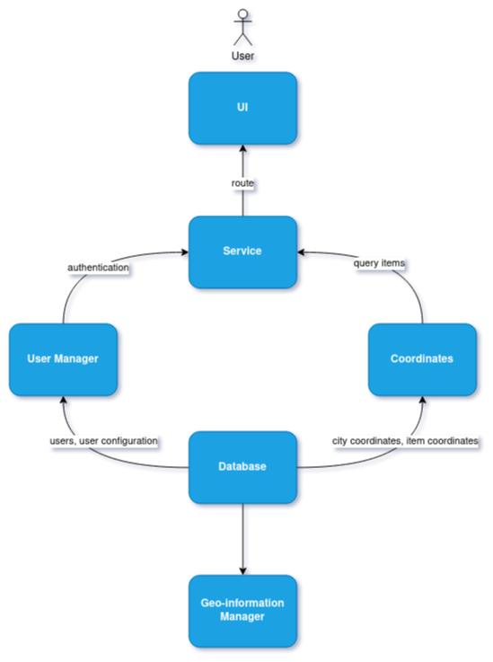
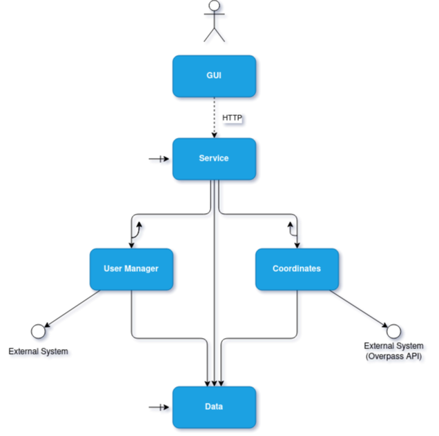
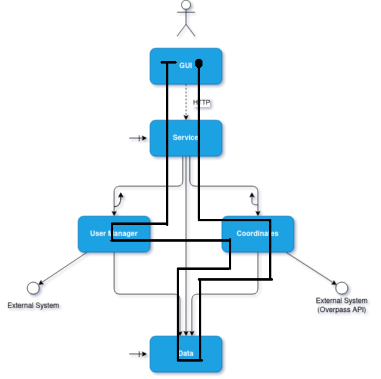
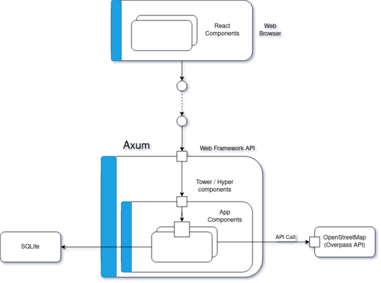
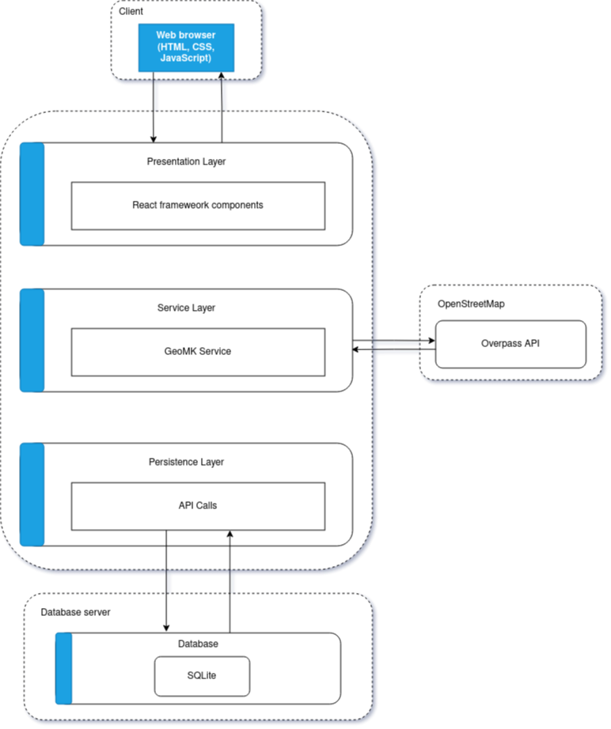
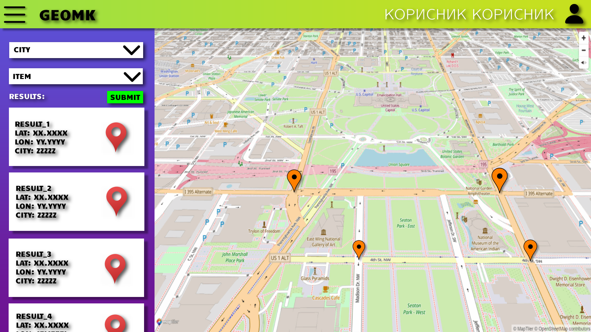

# GEOMK

GeoMK is a web server written in Rust that queries [OpenStreetMap](https://www.openstreetmap.org)
through the [Overpass API](https://overpass-turbo.eu) and retrieves coordinates based on user
queries.

## EXAMPLE

## ARCHITECTURAL DESIGN

### CONCEPTUAL VIEW

The conceptual view of the service shows how the UI communicates with the user manager, and the
coordinates service, which both get their information from the database. After the information
has been queried from the database, the UI gets updated.

### EXECUTION

The execution design shows the service during its runtime. The service sends asynchronous calls to
the coordinates and user manager service. Both of these services communicate with external systems.

If we were to trace the service's execution:

1. User submits their request.
2. User manager authenticates the user.
3. Query parameters get passed to the Overpass API (abstracted).
4. Relevant information gets written into the database.
5. Coordinates go through a pipe-and-filter.
6. Information is returned to the user.
7. Coordinates are mapped on the UI.

Here is an image showing the flow of execution during runtime:

### IMPLEMENTATION

The implementation architecture goes in great depth about the system's implemented technologies
and functionalities.

The system displays React components to the user. Users interact with the service through these
components. The HTTP server is responsible for retrieving information from the server to the user.
Below, we will wee how the server is implemented, what technologies we use and how these
technologies communicate with each other.

[Axum](https://github.com/tokio-rs/axum) uses `tower` and `hyper` under the hood to manage web
requests in a streamlined fashion.

- Information is retrieved from Overpass.

- All information gets written to a local SQLite database.

A detailed explanation of the server's execution after a user sends a query:

Note the pipe-and-filter design pattern, which sends the coordinates down a pipe, runs filters on
the coordinates, and returns a new list of coordinates (possibly reduces), so that they match the
user's initial queries.

## GUI MOCKUP

A simple mockup image of GeoMK's frontend:

## PROJECT STRUCTURE

## LICENSE

This software is licensed under the [GPL v3.0 License](https://www.gnu.org/licenses/gpl-3.0.en.html).

## LIVE DOCUMENTATION

As this repository grows, the documentation changes along with it - providing information that is
up to date and relevant to the state of this project.

## CONTRIBUTORS

- Bojan Milevski, 211561
- Kristijan Selchanec, 211543
- Damjan Gjorgjievski, 211538
- Marko Zafirovski, 211274
- Nikola Ivanovski, 216127
